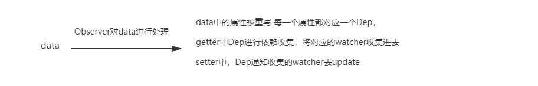

# 实现一个简单vue响应式系统(一)

## 访问代理
   为什么组件选项中数据是定义再data中，并且返回的是一个对象，但是我们使用时却可以跳过直接访问，本来是this.data.a却只用写成this.a的形式？原来是vue中为了使用方便做了一层访问代理，其原理其实也非常简单, Object.defineProperty这个api可以轻松做到
   
   ```js
   /**
    * 访问代理 访问obj1中某个属性时，都会返回obj2的对应属性的值 
    * 对obj1的某个属性赋值时，实际上会对obj2的同名属性进行赋值
   */
   function proxy(obj1, obj2, key) {
    Object.defineProperty(obj1, key, {
      enumerable: true,
      get() {
        return obj2[key]
      },
      set(newVal) {
        obj2[key] = newVal
      }
    })
  }
   ```


##  简单梳理响应式原理
vue的响应式实现中有三个重要的类Observer, Dep, Watcher, 这三者是怎么实现数据响应式更新的呢，先忽略其他无关步骤和环节，我们只考虑初始化，渲染， 更新三个主要阶段，看看vue是怎么实现响应式的
- 初始化Observer类利用Object.definePropert对data中的属性进行重写，每一个属性被重写时都创建了对应的Dep实例, 在getter中利用Dep实例收集当前的watcher,在setter中通知收集的watcher进行更新的操作
- 渲染 创建一个渲染watcher去执行渲染操作,除了渲染watcher还会有computed watcher, user watcher,对应的就是我们computed和watch选项中为每个属性创建的watcher,这里暂时忽略，只考虑渲染watcher。这个过程必然要涉及到数据的读取，也就会触发上述的getter，依赖收集就是在这个时候完成的，所有的数据读取完后，每一个数据（属性）通过它的Dep也就和当前的渲染watcher建立了联系
- 更新 当数据被更改时，setter触发，Dep实例通知渲染watcher进行更新。



可以得到结论，当不考虑computed watcher, user watcher时，一个组件这是只有一个watcher，每个属性对应一个Dep实例

## 极简版的Vue构造函数
```js
function Vue(options) {
  this.init(options)
  this.$mount()
}
Vue.prototype = {
  init(options) {
    this.options = options
    let vm = this
    initState(vm)
  },
  $mount(){
    let vm = this
    new Watcher(vm, vm.options.render, function() {})
  }
}

function initState(vm) {
  let data = vm.options.data
  data = vm._data = typeof data === 'function' ? data.call(vm) : data || {}
  let keys = Object.keys(data)
  let i = keys.length
  while(i--) {
    // proxy参考上一代码块的代码
    proxy(vm, vm._data, keys[i])
  }
  observe(data)
}
/**
 * 使用Observe对对象进行属性重写
*/
function observe(data) {
  if (typeof data === 'object' && data !== null) {
    data.__ob__ = new Observe(data)
  }
}

```
## Observe类的代码
```js
function Observe(data) {
  let keys = Object.keys(data)
  let i = keys.length
  while(i--) {
    defineReactive(data, keys[i])
  }
}

function defineReactive(data, key) {
  let value = data[key]
  let dep = new Dep()
  Object.defineProperty(data, key, {
    enumerable: true,
    configurable: true,
    get() {
      /**
       * 将当前运行的watcher收集起来
       * Dep.target指向的就是当前watcher
      */
      if (Dep.target) {
        dep.depend()
      }
      return value
    },
    set(newVal) {
      if (value !==  newVal) {
        value = newVal
        // value可能是一个对象，继续处理
        observe(value)
        dep.notify()
      }
    }
  })
  // value可能也是一个对象，继续处理
  observe(value)
}

```
## Dep和Watcher类的代码
```js
// 初始化Dep和Watcher实例的id
let wid = 0
let did = 0 

function Dep() {
  this.subs = []  // 存储watcher
  this.id = did++
}
Dep.prototype = {
  depend() {
    if (Dep.target) {
      Dep.target.addDep(this)
    }
  },
  addSub(watcher) {
    this.subs.push(watcher)
  },
  notify() {
    this.subs.forEach(watcher => {
      watcher.update()
    });
  }
}

function Watcher(vm, fn, cb, options) {
  this.vm = vm
  this.fn = fn
  this.cb = cb
  this.options = options || {}
  this.id = wid++
  this.deps = []
  this.depIds = new Set()
  this.value = this.getValue()
}
Watcher.prototype = {
  getValue() {
    // Dep.targetj就是在这里指向当前watcher, 结束后重新指向null
    Dep.target = this
    this.fn.call(this.vm)     
    Dep.target = null
  },
  addDep(dep) {
    // 在这里Dep实例保存了当前的watcher,同时watcher也保存了这个Dep
    if (!this.depIds.has(dep.id)) {
      this.depIds.add(dep.id)
      this.deps.push(dep)
      dep.addSub(this)
    }
  },
  update() {
    this.getValue()
  }
}
```
## 完整的示例代码

```html
<!DOCTYPE html>
<html lang="en">
<head>
  <meta charset="UTF-8">
  <meta name="viewport" content="width=device-width, initial-scale=1.0">
  <meta http-equiv="X-UA-Compatible" content="ie=edge">
  <title>Document</title>
</head>
<body>
  <div><button id="btn">点击</button></div>
  <div>---------------------------</div>
  <div id="app"></div>
  <script src="./vue.js"></script>
  <script>

    const app = document.querySelector('#app')
    const btn = document.querySelector('#btn')

    let vm = new Vue({
      data() {
        return {
          firstName: 'wale',
          lastName: 'Smith',
          age: 18
        }
      },
      render(h) {
        app.innerHTML = `<div class="user"><span>${this.firstName}</span>: <span>${this.age}</span></div>`
      },
    })

    
    btn.addEventListener('click', () => {
      console.log(vm.age)
      vm.age = vm.age + Math.ceil(Math.random()*10)
    })

  </script>
</body>
</html>
```


```js

let wid = 0
let did = 0 

function Dep() {
  this.subs = []
  this.id = did++
}
Dep.prototype = {
  depend() {
    if (Dep.target) {
      Dep.target.addDep(this)
    }
  },
  addSub(watcher) {
    this.subs.push(watcher)
  },
  notify() {
    this.subs.forEach(watcher => {
      watcher.update()
    });
  }
}

function Watcher(vm, fn, cb, options) {
  this.vm = vm
  this.fn = fn
  this.cb = cb
  this.options = options || {}
  this.id = wid++
  this.deps = []
  this.depIds = new Set()
  this.value = this.getValue()
}
Watcher.prototype = {
  getValue() {
    Dep.target = this
    this.fn.call(this.vm)     
    Dep.target = null
  },
  addDep(dep) {
    if (!this.depIds.has(dep.id)) {
      this.depIds.add(dep.id)
      this.deps.push(dep)
      dep.addSub(this)
    }
  },
  update() {
    this.getValue()
  }
}

function Observe(data) {
  let keys = Object.keys(data)
  let i = keys.length
  while(i--) {
    defineReactive(data, keys[i])
  }
}

function defineReactive(data, key) {
  let value = data[key]
  let dep = new Dep()
  Object.defineProperty(data, key, {
    enumerable: true,
    configurable: true,
    get() {
      if (Dep.target) {
        dep.depend()
      }
      return value
    },
    set(newVal) {
      if (value !==  newVal) {
        value = newVal
        observe(value)
        dep.notify()
      }
    }
  })
  observe(value)
}

function proxy(vm, source, key) {
  Object.defineProperty(vm, key, {
    enumerable: true,
    configurable:true,
    get() {
      return vm[source][key]
    },
    set(newVal) {
      vm[source][key] = newVal
    }
  })
}

function observe(data) {
  if (typeof data === 'object' && data !== null) {
    data.__ob__ = new Observe(data)
  }
}

function initState(vm) {
  let data = vm.options.data
  data = vm._data = typeof data === 'function' ? data.call(vm) : data || {}
  let keys = Object.keys(data)
  let i = keys.length
  while(i--) {
    proxy(vm, '_data', keys[i])
  }
  observe(data)
}

function Vue(options) {
  this.init(options)
  this.$mount()
}
Vue.prototype = {
  init(options) {
    this.options = options
    let vm = this
    initState(vm)
  },
  $mount(){
    let vm = this
    new Watcher(vm, vm.options.render, function() {})
  }
}

```